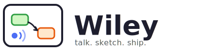
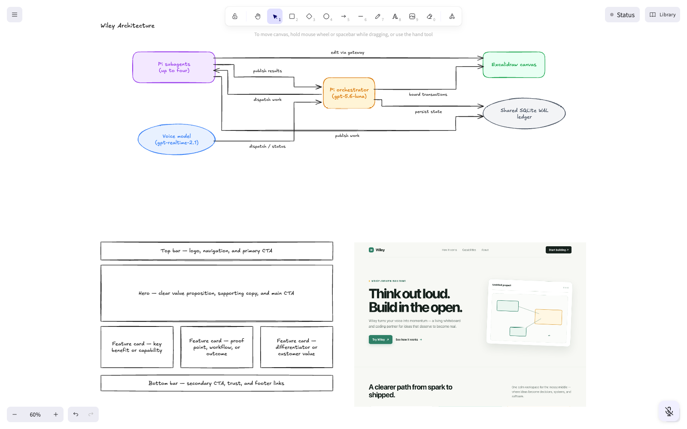
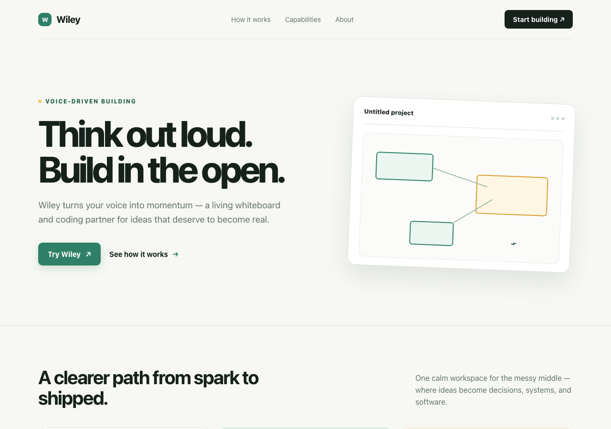

<p align="center">
  
</p>

<p align="center">
  <b>The cracked coworker at the whiteboard, with a laptop.</b><br/>
  You talk and sketch. Wiley draws, codes, runs, and ships, live, on the same board.
</p>

<p align="center">
  
  
  
  
</p>

---

Chat windows made AI feel like a ticketing system: type a request, wait, read a wall of text. Wiley is a different interaction model. It is the colleague you grab a whiteboard with. You think out loud, half-draw an idea, wave at a box and say "connect that to the voice thing", and it happens, while the same colleague quietly opens a laptop, writes the code, runs the commands, and pins a screenshot of the result next to your sketch.

One voice, one board, real hands.

<p align="center">
  
</p>

<p align="center"><sub>One unedited board from the automated end-to-end scenario: Wiley drew the architecture diagram, labelled a hand-drawn six-box wireframe without touching the sketch, built the site from it, and pinned the rendered screenshot beside the drawing.</sub></p>

## What a session feels like

- "Draw how this project works." A validated, ELK-laid-out diagram grows on the board in front of you: sized nodes, distributed connector ports, labels that never sit on top of each other.
- You sketch six rough boxes and say "that's a landing page, fill it in." Wiley labels **your** rectangles. It does not clear your board. It does not redraw your sketch. Your drawing is the spec.
- "Build it." Wiley writes the site, screenshots it headlessly, and places the screenshot on the board next to your wireframe.
- "Open it." It runs `open site/index.html`. Your browser appears with the real page.
- "What have you done so far?" It actually knows: current work, queued work, and the final report of every recent task.

The whole time, you can interrupt mid-sentence. Interruption is the default at every layer: your voice interrupts the orchestrator, the orchestrator interrupts its workers, and everyone verifies what their half-finished action actually did before continuing.

<p align="center">
  
</p>

<p align="center"><sub>Wiley's own work: the landing page it designed, wrote, screenshotted, and opened, starting from six hand-drawn rectangles. Copy included.</sub></p>

## Why this is different

**The board is shared ground truth, not a render target.** Humans and agents edit the same Excalidraw scene through a serialized transaction gateway with revision checks and leases. Human edits win conflicts. The agent can move, resize, recolor, relabel, and connect your hand-drawn elements as first-class citizens, and every mutation lands as a coherent undo step.

**Drawing quality is engineered, not prompted.** Diagram layout runs through ELK with node sizes measured in the actual rendered font, connector ports spread by edge degree, and edge labels placed in reserved space. A stress suite asserts zero node overlaps, zero label collisions, zero edges through nodes, zero shared ports, and zero merged parallel runs across adversarial graphs, measured against the real Excalifont glyph metrics.

**The agent has real hands.** Behind the voice sits a persistent [Pi](https://github.com/earendil-works/pi) orchestrator with full read, bash, edit, write, grep, find, and ls tools plus up to four parallel subagent sessions, all sharing the canonical conversation and the board. It codes, tests, screenshots, and opens things on your machine.

**Safety without ceremony.** A hard guard unconditionally blocks catastrophic destruction (home, root, disks, credential stores, fork bombs). Above it, a cheap approval model reviews risky bash, edit, and write calls against your recent spoken requests, fails open, and announces every block out loud so you hear "I stopped myself" in real time. Blocked agents must escalate to you by voice; they are forbidden to retry or work around it.

**One persona.** Voice model, orchestrator, and subagents present as a single coworker. Progress is first-person, at most one short sentence, and never narrates internal machinery.

## Architecture in one breath

`gpt-realtime-2.1` handles ears and mouth over WebRTC and holds no power beyond dispatch, status, and answers. Every real action flows through the root Pi session (`gpt-5.6-luna`, medium thinking), which owns coding tools, board tools (`draw_diagram`, `connect_shapes`, `edit_canvas`, `place_image`, ...), subagents, and the safety stack. A SQLite WAL ledger persists the transcript, jobs, agent events, and board snapshots. The renderer is a sandboxed Excalidraw surface; the silent `[board update]` channel keeps the voice model passively aware of what you just drew, so "connect these two" simply resolves.

## Run it

Requirements: macOS Apple Silicon, Node 22.19+, and an OpenAI API key with access to the configured models.

```bash
cp .env.example .env   # set OPENAI_API_KEY
npm install
npm run dev:web        # browser shell at http://localhost:5173
npm run dev            # or the Electron shell
```

The renderer never sees your API key; the backend mints short-lived Realtime client secrets. Pi can also use credentials already configured in `~/.pi/agent/auth.json`.

Optional settings:

| Variable | Effect |
| --- | --- |
| `BOARD_AI_PROJECT_DIR` | Workspace the coding tools may edit (default: launch directory) |
| `BOARD_AI_DATA_DIR` | Directory for the SQLite ledger |
| `VOICE_DISABLED=1` | Keeps Realtime offline and shows a text input for harness testing |
| `WILEY_APPROVAL_MODEL` | Reviewer model for risky tool calls (default `gpt-5.4-mini`) |
| `WILEY_APPROVAL_DISABLED=1` | Disables the reviewer; the catastrophic guard always stays on |

The only persistent voice control is the microphone button in the bottom-right. Muting stops capture only; playback and background work continue.

## Verify and package

```bash
npm run typecheck
npm test               # unit + layout stress suite, real font metrics, no tokens
npm run build
npm run package:mac    # unsigned arm64 DMG in release/
```

### The scenario that has to work

```bash
npm run test:e2e:landing   # real model, real browser, costs tokens
```

This drives the full session end to end: chat context, architecture diagram, a hand-drawn wireframe injected through the app's own pipeline, label fill-in on the human's boxes with nothing cleared, website generation, screenshot placed on the board, and a real `open` of the built page. Ten assertions; artifacts (logs, board JSON, screenshots) land in `.e2e/run-*/`. Render any run's persisted board with `node scripts/board-shot.mjs <run>/data out.png`. Both screenshots above came straight out of this scenario.

## Runtime boundaries

The renderer is sandboxed with no Node access; it owns WebRTC audio and Excalidraw rendering. The Electron main process owns credentials, the ledger, Pi sessions, job interruption, safety guards, and the serialized board transaction gateway. The Realtime capability manifest contains no mutation, shell, filesystem, git, or subagent-spawn tool.

Implementation details and the deterministic/real-model test matrix: [docs/pi-harness-guide.md](docs/pi-harness-guide.md) and [docs/agent-test-procedure.md](docs/agent-test-procedure.md).
